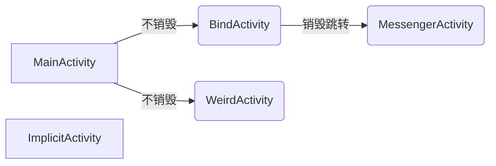

# 关于科研训练测试样例的说明

## 设计的情况

*以下情况是样例中设计的，超出此范围考虑其他问题。*

### 设计的service调用类型

- 直接调用（启动状态，在主线程，不同activity共存亡）
- 绑定调用（绑定状态，扩展Binder，不跨进程，新建线程，随activity消亡）
- 绑定调用（使用Messenger，跨进程通信，新建进程）
- 直接调用（启动为前台服务）

### 设计的异常类型

#### 有关调用的异常

- 有此service但调用它的activity无法被访问到
- 启动service之后没有关闭，但activity被销毁
- 5.0+禁止的隐式调用方式，且该调用无匹配的service

#### service内部的异常

*参考 <Systematically Testing Background Services of Mobile Apps> 的  **CASE STUDIES**  一节设计*

- 空指针异常（数组越界）
- 迭代或循环消耗资源

## service及其异常分布和调用情况

| service类名 | 调用的activity | 调用异常 | 内部异常 | 启动方式 |
| :---: | :---: | :---: | :---: | :---: |
| ServiceTheSimple | MainActivity |  | O | 直接 |
| LocalService | BindActivity | O |  | 绑定 |
| MessengerService | MessengerActivity |  | O | 新进程 |
| ImplicitService | ImplicitActivity | O |  | 前台 |
| WeiredService | WeiredActivity | O | O | 直接 |

- 每个对应的Activity都有start和stop按钮绑定启动和销毁Service的方法，某些组件存在与service通信的方法，也以按钮形式出现。



*以下是详细说明*

------

### ServiceTheSimple

- 该服务的异常存在于onDestroy()，在调用super.onDestroy()之后，理论上服务调用已经结束，但还没有走出该service。
- 异常是在testUsage类的usageData方法，该方法返回值时访问数组越界。

```java
@Override
    public void onDestroy() {
        System.out.println("onDestroy invoke");
        super.onDestroy();
        System.out.println("shoud have a null-pointer exception here");
        new testUsage().usageData();
    }
```

### LocalService

- 该服务首先在创建activity时以直接启动方式启动（startService），按下绑定按钮后服务会被绑定到activity中（bindService）。
- 直接启动方式下，没有提供调用onDestroy的方式，一旦该activity跳转（同时自身finish），service将一直在后台运行，除非系统资源耗尽。
- 绑定方式下，如果该activity跳转（同时自身finish），service将失去绑定对象而崩溃。
- 解绑之后可以正常跳转。

### MessengerService

- 该服务出于未知情况没有创建service，表现为service的onCreate和onBind都没有输出log，但ServiceConnection成功收到本应从onBind获取的IBinder对象返回，成功启动连接，log显示已经连接上一个进程，但尝试进程通信失败。
- 该服务设计上应当能正常调用

### ImplicitService

- 调用该服务的activity不在动态可访问到的范围内，没有任何activity可以跳转到。

### WeiredService

- 该服务在对应activity创建时被创建，但在onStartCommand方法中启动新的服务，且没有提供onDestroy调用，会持续创建新服务（在主线程）。